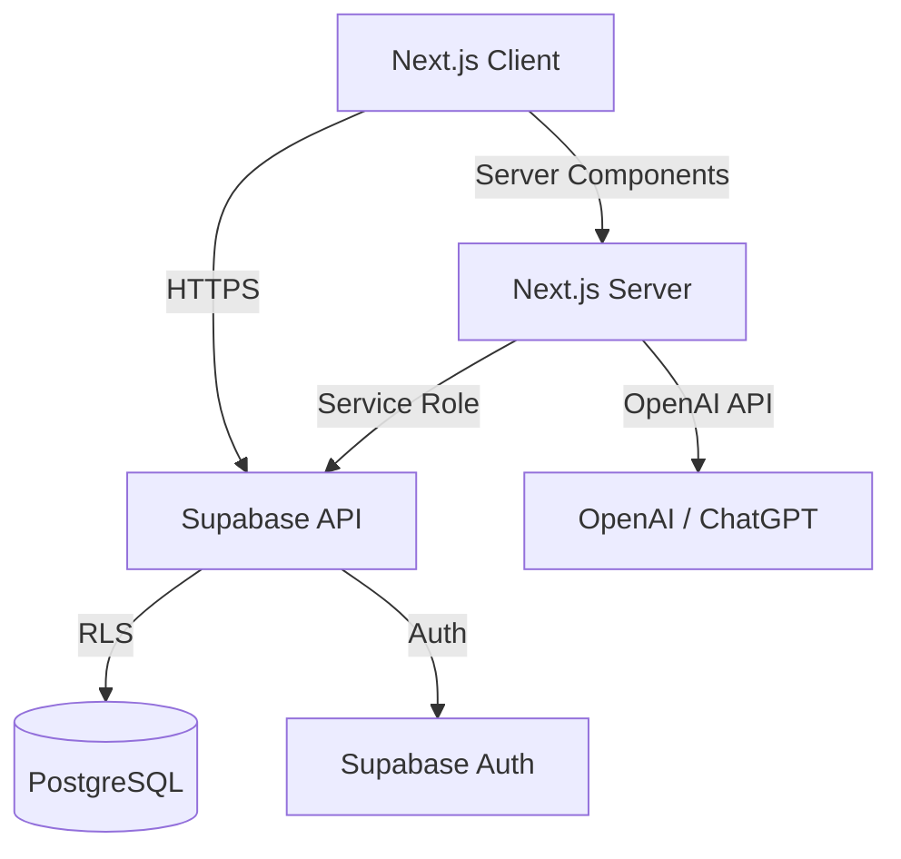
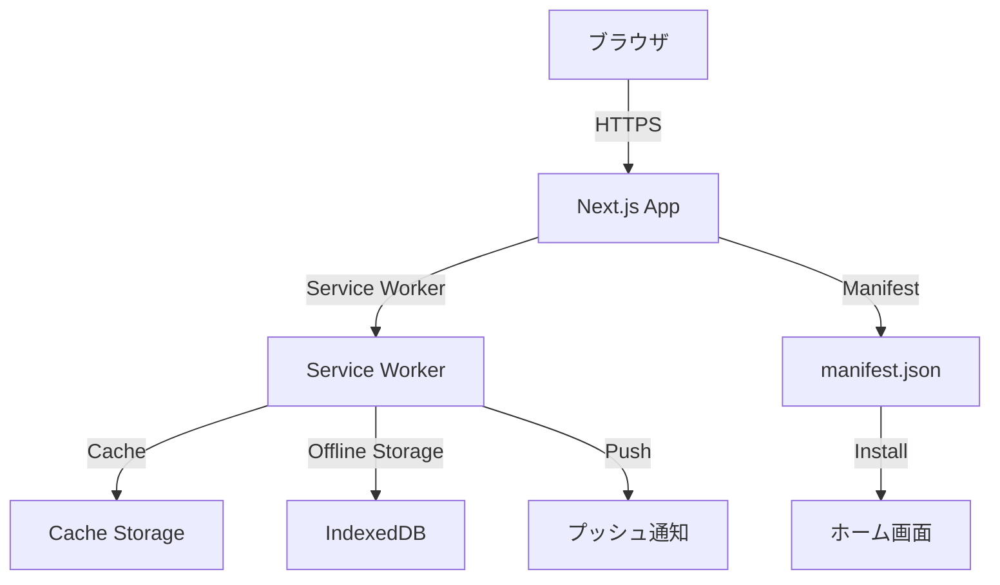
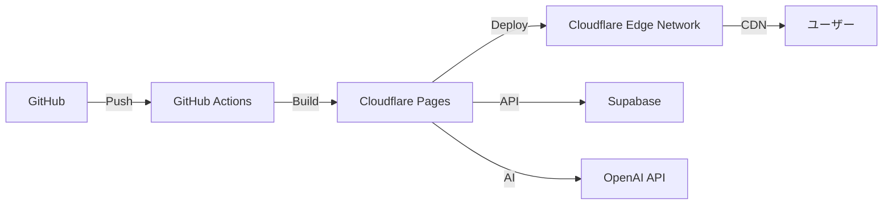

# 詳細設計書：全体アーキテクチャ

## 2. 全体アーキテクチャ

### 2.1 Next.js 16 App Router 構成

```
src/app/
├── layout.tsx          # ルートレイアウト
├── page.tsx            # トップページ
├── (dashboard)/        # ダッシュボードグループ（将来実装）
├── diary/              # 日記関連ページ（将来実装）
│   ├── page.tsx        # 日記一覧
│   ├── [id]/           # 日記詳細・編集
│   └── new/            # 新規作成
└── api/                # API Route Handlers（将来実装）
    ├── diaries/        # 日記 CRUD
    ├── ai/             # AI 機能（補完・分析）
    └── auth/           # 認証関連
```

### 2.2 Supabase アーキテクチャ



**主要機能：**
- **PostgreSQL**：メインのデータストレージ
- **RLS（Row Level Security）**：ユーザー単位でのデータ分離
- **Supabase Auth**：Email / OAuth 認証
- **Supabase Storage**：日記添付ファイル（画像・動画）の保存

### 2.3 Frontend Architecture

```
src/
├── app/                # Next.js App Router ページ
├── components/
│   └── ui/            # shadcn/ui コンポーネント（50+ コンポーネント）
├── schemas/           # Zod スキーマ（テーブル・フォーム用）
│   ├── base.ts        # 共通スキーマ
│   ├── tables/        # テーブルスキーマ（DB行用）
│   ├── forms/         # フォームスキーマ（入力・更新用）
│   └── index.ts       # エクスポート集約
├── lib/
│   ├── supabase.ts    # Supabase クライアント生成
│   ├── utils.ts       # ユーティリティ関数
│   └── ai/            # AI 統合ロジック（将来実装）
└── hooks/
    └── use-mobile.ts  # モバイル判定フック
```

### 2.4 AI Integration（OpenAI API）

**実装予定機能：**
- **文章補完**：リアルタイムで文章を補完・推敲
- **感情分析（Sentiment Analysis）**：日記本文から感情スコアを抽出
- **トピック分析（Topic Modeling）**：日記の主要トピックを自動抽出
- **自動タグ生成**：内容に基づいてタグを自動付与
- **Summary 生成**：日記の要約を自動生成

**API フロー：**
```
日記保存 → Server Action → OpenAI API 呼び出し → 結果を DB に保存
```

### 2.5 PWA構成（将来実装）



**主要機能:**
- **Service Worker**: オフライン対応、キャッシング、プッシュ通知
- **manifest.json**: PWA メタデータ、インストール設定
- **IndexedDB**: オフライン時のデータストレージ
- **Cache Storage**: 静的アセット・API レスポンスのキャッシュ

**ファイル構成:**
```
public/
├── manifest.json          # PWA マニフェスト
├── sw.js                  # Service Worker
├── icon-192x192.png      # アプリアイコン（192x192）
├── icon-512x512.png      # アプリアイコン（512x512）
└── icon-maskable.png     # マスク可能アイコン

src/
├── components/
│   └── pwa/
│       ├── InstallPrompt.tsx      # インストールプロンプト
│       ├── OfflineIndicator.tsx   # オフラインインジケーター
│       └── PwaScript.tsx          # Service Worker 登録
└── lib/
    └── offline-storage.ts         # IndexedDB 操作
```

### 2.6 デプロイ構成（Cloudflare Pages）



**特徴：**
- **@opennextjs/cloudflare**：Next.js を Cloudflare Pages に最適化
- **Edge Network**：グローバル CDN による高速配信
- **KV Storage**：セッション管理やキャッシュ（将来実装）
- **PWA対応**：Service Worker と manifest.json を配信

---

**関連ドキュメント:**
- [基本設計書](./100_BasicDesign.md)
- [機能設計](./204_DetailedDesign_Functions.md)

