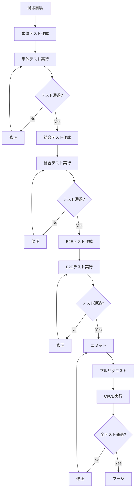

# テスト運用ガイドライン：概要

## 1. テストの全体像

### 1.1 テストピラミッド

auriary プロジェクトにおけるテストの優先順位は以下の通りです：

```
        /\
       /  \
      / E2E \          ← 最重要（ユーザー体験の保証）
     /--------\
    /          \
   / Integration \    ← 重要（API・DB連携の保証）
  /--------------\
 /                \
/   Unit Test      \  ← 基礎（ロジックの保証）
/------------------\
```

**優先順位の理由：**
- **E2Eテスト**: ユーザーが実際に使用する機能を検証。最も重要なテスト階層
- **結合テスト**: API Route Handler と Supabase の連携を検証。RLS ポリシーの動作確認
- **単体テスト**: ユーティリティ関数、Zod スキーマ、ロジックの検証

### 1.2 テストの実行タイミング

| テスト種類 | 開発時 | コミット前 | PR時 | デプロイ前 |
|-----------|--------|----------|------|----------|
| 単体テスト | ✅ ウォッチモード | ✅ 必須 | ✅ 必須 | ✅ 必須 |
| 結合テスト | ⚠️ 必要時 | ✅ 必須 | ✅ 必須 | ✅ 必須 |
| E2Eテスト | ⚠️ 必要時 | ⚠️ 主要フローのみ | ✅ 必須 | ✅ 必須 |

---

## 2. 開発〜テストの流れ

### 2.1 開発フロー



### 2.2 実装例：日記作成機能

#### Step 1: 機能実装

```typescript
// src/lib/validators/diary.ts
import { z } from 'zod';

export const createDiarySchema = z.object({
  diary_date: z.string().date(),
  note: z.string().max(10000).optional(),
  // ...
});
```

#### Step 2: 単体テスト作成

```typescript
// src/lib/validators/diary.test.ts
import { createDiarySchema } from './diary';

describe('createDiarySchema', () => {
  it('有効な日記データを検証する', () => {
    const data = {
      diary_date: '2025-01-10',
      note: 'Test note',
    };
    expect(createDiarySchema.parse(data)).toEqual(data);
  });
});
```

#### Step 3: 結合テスト作成

```typescript
// src/__tests__/integration/api/diaries.test.ts
import { createDiary } from '@/app/actions/diary';

describe('POST /api/diaries', () => {
  it('日記を作成できる', async () => {
    const diary = await createDiary({
      diary_date: '2025-01-10',
      note: 'Test note',
    });
    expect(diary.id).toBeDefined();
  });
});
```

#### Step 4: E2Eテスト作成

```typescript
// e2e/diary/create.spec.ts
import { test, expect } from '@playwright/test';

test('日記を作成できる', async ({ page }) => {
  await page.goto('/diary/new');
  await page.fill('textarea[name="note"]', 'Test diary');
  await page.click('button[type="submit"]');
  await expect(page.locator('text=日記を保存しました')).toBeVisible();
});
```

---

**関連ドキュメント:**
- [開発フロー・ワークフロー](./402_Workflow.md)
- [コミット・PR規約](./403_Commit_PR.md)
- [単体テスト戦略](../500_Unit_Test/500_Strategy.md)
- [結合テスト戦略](../600_Integration_Test/600_Strategy.md)
- [E2Eテスト戦略](../700_E2E_Test/700Strategy.md)

