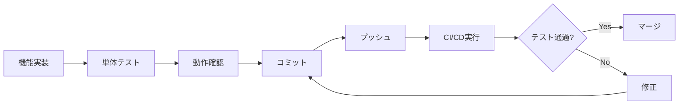

# テスト運用ガイドライン：開発フロー・ワークフロー

## 6. 1人開発に最適化したワークフロー

### 6.1 日常的な開発フロー



### 6.2 効率的なテスト戦略

#### 優先順位1: E2Eテスト

- 主要なユーザーフローは必ずE2Eテストでカバー
- 1つのE2Eテストで複数の機能を検証

#### 優先順位2: 結合テスト

- API Route Handler の動作を検証
- RLS ポリシーの動作を検証

#### 優先順位3: 単体テスト

- 複雑なロジックのみ単体テスト
- シンプルな関数は結合テストでカバー

### 6.3 時間節約のコツ

1. **テストの自動生成**: Cursor を活用してテストを自動生成
2. **テストテンプレート**: よく使うテストパターンをテンプレート化
3. **並列実行**: テストを並列実行して時間を短縮

---

## 15. 実践的なワークフロー例

### 15.1 新機能追加時のワークフロー

1. **機能実装**
   ```bash
   # ブランチ作成
   git checkout -b feature/diary-edit
   
   # 機能実装
   # ...
   ```

2. **単体テスト作成・実行**
   ```bash
   # 単体テストを作成
   # src/lib/validators/diary.test.ts
   
   # テスト実行
   pnpm test:unit src/lib/validators/diary.test.ts
   ```

3. **結合テスト作成・実行**
   ```bash
   # 結合テストを作成
   # src/__tests__/integration/api/diaries.test.ts
   
   # テスト実行
   pnpm test:integration
   ```

4. **E2Eテスト作成・実行**
   ```bash
   # E2Eテストを作成
   # e2e/diary/edit.spec.ts
   
   # テスト実行
   pnpm test:e2e
   ```

5. **コミット・プッシュ**
   ```bash
   git add .
   git commit -m "feat: 日記編集機能を追加

   - 日記編集APIを実装
   - 単体テスト、結合テスト、E2Eテストを追加"
   
   git push origin feature/diary-edit
   ```

6. **プルリクエスト作成**
   - プルリクエストを作成
   - CI/CD でテストが自動実行
   - テストが通過したらマージ

### 15.2 バグ修正時のワークフロー

1. **バグを再現するテストを作成**
   ```typescript
   it('バグを再現する', () => {
     // バグを再現するテスト
   });
   ```

2. **バグを修正**
   ```typescript
   // バグを修正
   ```

3. **テストが通過することを確認**
   ```bash
   pnpm test
   ```

4. **コミット・プッシュ**
   ```bash
   git commit -m "fix: 日記保存時のバグを修正

   - バグを再現するテストを追加
   - バグを修正
   - テストが通過することを確認"
   ```

---

**関連ドキュメント:**
- [概要](./401_Overview.md)
- [テスト実行タイミング](./405_Execution.md)
- [CI/CD](./406_CI_CD.md)

